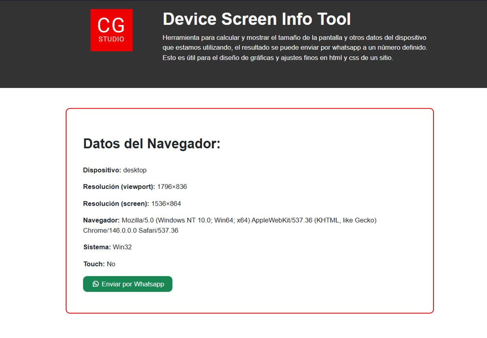

# Device Screen Info Tool

Herramienta web simple para obtener información del dispositivo, navegador y pantalla del usuario en tiempo real.

Este proyecto fue creado para facilitar tareas de **ajustes CSS**, **validación responsive**, **soporte frontend** y **adaptación de gráficas o elementos visuales** según el entorno real del cliente.



## Demo

Puedes ver una versión publicada del proyecto aquí:  
[Ver demo online](https://cgstudio.cl/projects/Device-Screen-Info-Tool/)

## ¿Qué hace esta herramienta?

Al abrir la página, la herramienta detecta y muestra información útil del dispositivo desde el navegador, como por ejemplo:

- Tipo de dispositivo
- Resolución del viewport
- Resolución de pantalla
- Navegador
- Sistema / plataforma
- Soporte táctil
- Device Pixel Ratio (DPR)
- Orientación de pantalla
- Safe Area
- Preferencias del usuario
- Datos técnicos del navegador
- Resumen listo para enviar por WhatsApp

## ¿Para qué sirve?

Este proyecto es útil para casos como:

- Ajustes finos de **CSS responsive**
- Revisión de problemas visuales reportados por clientes
- Validación de **breakpoints**
- Adaptación de banners, gráficas o módulos HTML
- Diagnóstico rápido del entorno del usuario
- Soporte frontend con datos más precisos del dispositivo

## Funcionalidades principales

- Detección automática de datos del navegador y pantalla
- Clasificación del dispositivo como `mobile`, `tablet` o `desktop`
- Detección de breakpoint según el ancho del viewport
- Visualización de datos técnicos en pantalla
- Copia rápida de resumen o JSON
- Enlace directo para enviar el resumen por WhatsApp
- Actualización automática al cambiar tamaño u orientación

## Tecnologías utilizadas

- HTML5
- CSS3
- JavaScript Vanilla
- Bootstrap 5

## Estructura del proyecto

```bash
/
├── index.html
├── README.md
└── assets/
    ├── css/
    │   └── style.css
    └── img/
        └── preview.jpg